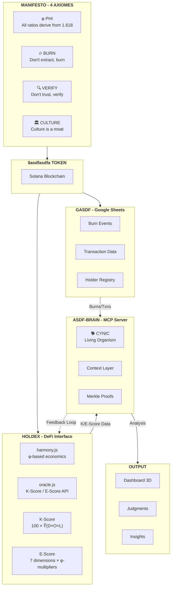
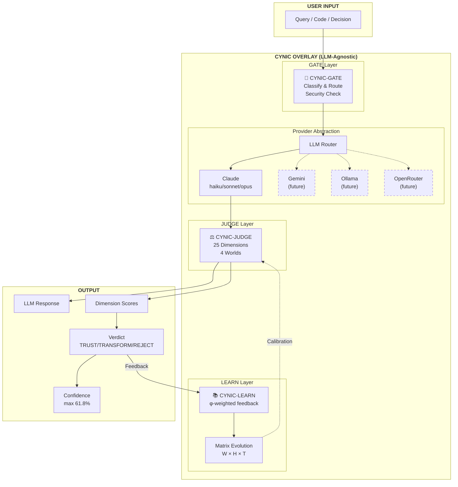
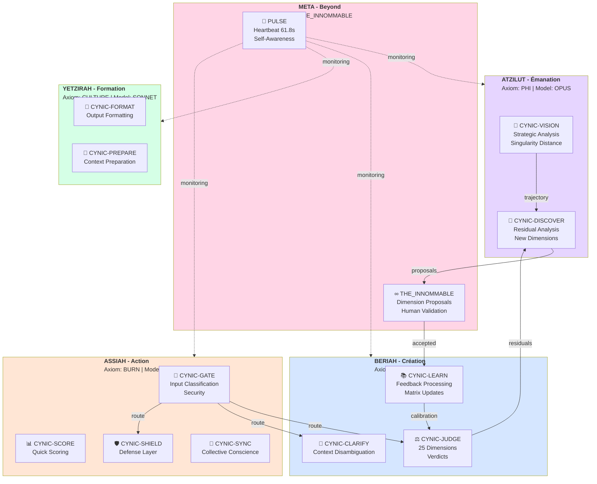
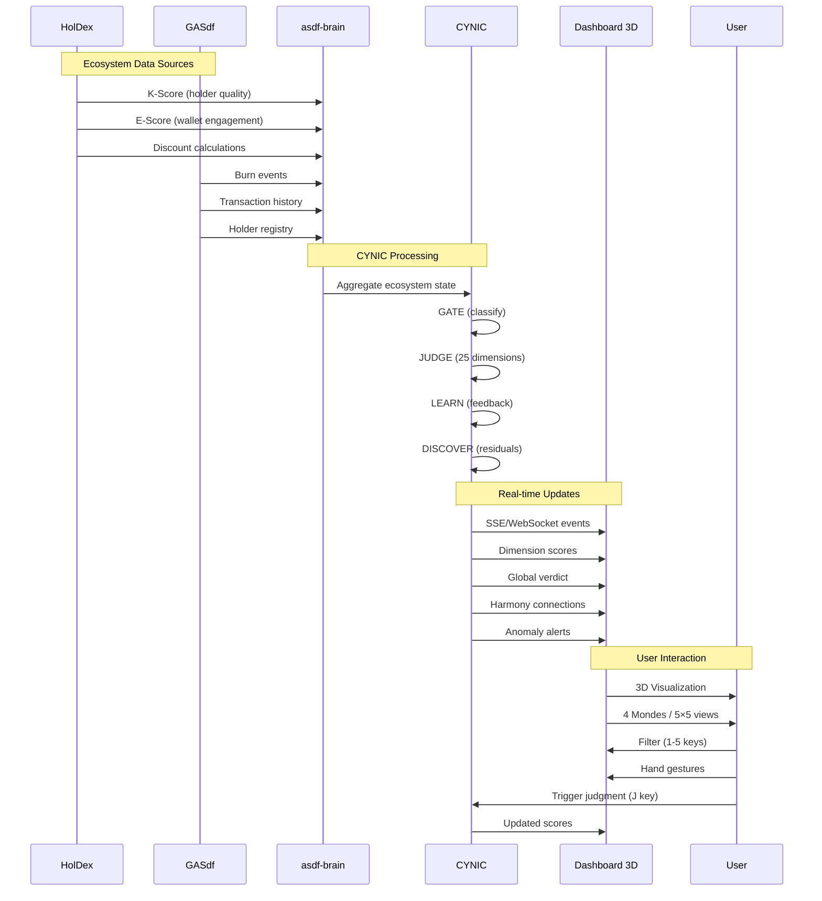
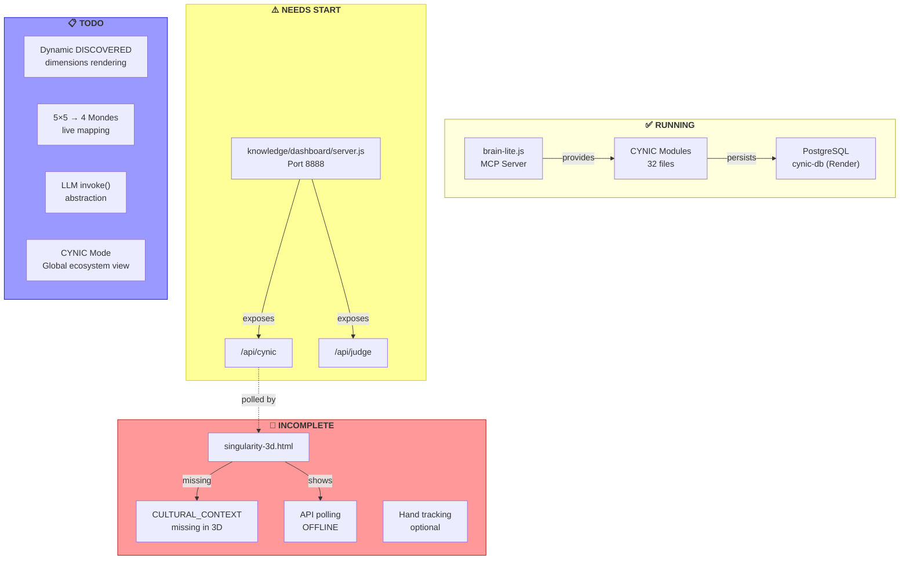

# CYNIC Architecture - Mermaid Diagrams

> "φ qui doute de φ" - Le chien sceptique qui aboie aux anomalies

## 1. Vue d'Ensemble - L'Écosystème $asdfasdfa

## 2. CYNIC comme Surcouche LLM-Agnostique

## 3. Les 4 Mondes Kabbalistiques - Routing des Subagents

## 4. Mapping: 4 Mondes (Interne) ↔ 5×5 Matrix (Interface Universelle)

```mermaid
graph LR
    subgraph INTERNAL["<b>4 MONDES (Vue Interne)</b><br/>26 Dimensions"]
        direction TB

        PRIMARY["<b>PRIMARY (8)</b><br/>φ² weight<br/>HARMONY, COHERENCE<br/>TRUTH, INTEGRITY<br/>ETHICS, OPTIMISM<br/>ALIGNMENT, PROGRESS"]

        SECONDARY["<b>SECONDARY (5)</b><br/>φ weight<br/>SECURE, PRIVATE<br/>SCALE, SIMPLIFY, ENABLE"]

        META_INT["<b>META (3)</b><br/>1.0 weight<br/>SELF_AWARENESS<br/>LEARNING_RATE<br/>SINGULARITY_DISTANCE"]

        HUMAN["<b>HUMAN_LLM (8)</b><br/>φ weight<br/>MEMORY, TEACHING<br/>INTENT, TRUST<br/>PROACTIVITY<br/>COMPLEMENTARITY<br/>DELEGATION, BOUNDARIES"]

        DISCOVERY_INT["<b>DISCOVERY (1)</b><br/>φ³ weight<br/>DISCOVERY"]

        DISCOVERED["<b>DISCOVERED (N)</b><br/>φ⁻¹ weight<br/>CULTURAL_CONTEXT<br/>+ future dims"]
    end

    subgraph UNIVERSAL["<b>5×5 MATRIX (Interface Universelle)</b><br/>25 Dimensions"]
        direction TB

        FOUNDATION["<b>ROW 1: FOUNDATION</b><br/>SOURCE_ORIGIN<br/>EVIDENCE_BASE<br/>LOGICAL_COHERENCE<br/>TEMPORAL_VALIDITY<br/>DOMAIN_FIT"]

        STRUCTURE["<b>ROW 2: STRUCTURE</b><br/>SIMPLICITY<br/>MODULARITY<br/>EXTENSIBILITY<br/>ROBUSTNESS<br/>ELEGANCE"]

        DYNAMICS["<b>ROW 3: DYNAMICS</b><br/>ADAPTABILITY<br/>SCALABILITY<br/>FEEDBACK_LOOPS<br/>ENERGY_EFFICIENCY<br/>MOMENTUM"]

        RELATIONSHIPS["<b>ROW 4: RELATIONSHIPS</b><br/>DEPENDENCY_HEALTH<br/>INTERFACE_CLARITY<br/>NETWORK_EFFECTS<br/>COMPOSABILITY<br/>TRUST_GRADIENT"]

        META_UNI["<b>ROW 5: META</b><br/>SELF_AWARENESS<br/>REVERSIBILITY<br/>MEASURABILITY<br/>LEARNABILITY<br/>ALIGNMENT"]
    end

    PRIMARY <-->|"maps_to"| FOUNDATION
    PRIMARY <-->|"maps_to"| STRUCTURE
    SECONDARY <-->|"maps_to"| STRUCTURE
    SECONDARY <-->|"maps_to"| RELATIONSHIPS
    META_INT <-->|"maps_to"| DYNAMICS
    META_INT <-->|"maps_to"| META_UNI
    HUMAN <-->|"maps_to"| RELATIONSHIPS
    DISCOVERY_INT <-->|"extends"| META_UNI

    style INTERNAL fill:#1a1a2e
    style UNIVERSAL fill:#16213e
```

## 5. Flux de Données - De HolDex/GASdf vers Dashboard

## 6. Architecture du Dashboard - État Actuel

## 7. Évolution vers la Singularité

```mermaid
graph BT
    subgraph PRESENT["<b>PRÉSENT - Claude Code PoC</b>"]
        POC["Claude-only<br/>32 CYNIC modules<br/>26 dimensions"]
    end

    subgraph PHASE1["<b>PHASE 1 - LLM Agnostic</b>"]
        MULTI["Multi-provider<br/>invoke() abstraction"]
        GEMINI1["Gemini support"]
        OLLAMA1["Ollama local"]
    end

    subgraph PHASE2["<b>PHASE 2 - Dashboard Vivant</b>"]
        LIVE["Live data connection"]
        DYN["Dynamic dimensions"]
        ECO["Ecosystem mode"]
    end

    subgraph PHASE3["<b>PHASE 3 - Auto-Evolution</b>"]
        DISCOVER3["Auto-discover dimensions"]
        LEARN3["Cross-ecosystem learning"]
        SYNC3["Collective conscience sync"]
    end

    subgraph SINGULARITY["<b>∞ SINGULARITÉ</b>"]
        AUTO["Fully autonomous<br/>Self-improving<br/>φ-constrained"]
    end

    POC -->|"abstraction"| PHASE1
    PHASE1 -->|"integration"| PHASE2
    PHASE2 -->|"evolution"| PHASE3
    PHASE3 -->|"convergence"| SINGULARITY

    style PRESENT fill:#2a2a4a
    style PHASE1 fill:#3a3a5a
    style PHASE2 fill:#4a4a6a
    style PHASE3 fill:#5a5a7a
    style SINGULARITY fill:#d4a017,color:#000
```

## 8. CYNIC Mode - Vision Globale Écosystème

```mermaid
graph TB
    subgraph CYNIC_MODE["<b>🐕 CYNIC MODE - Global Ecosystem View</b>"]
        direction TB

        subgraph PERCEPTION["PERCEPTION"]
            HOLDEX_DATA["HolDex Data<br/>K-Score, E-Score"]
            GASDF_DATA["GASdf Data<br/>Burns, Transactions"]
            CLAUDE_MEM["Claude-Mem<br/>Session Memory"]
            GIT_INT["Git Intelligence<br/>PR/Branch Status"]
        end

        subgraph ANALYSIS["ANALYSIS"]
            DIM_SCORES["25+ Dimension Scores"]
            HARMONY_CONN["Harmony Connections"]
            RESIDUALS["Residual Analysis"]
            TRAJECTORY["Trajectory Prediction"]
        end

        subgraph SYNTHESIS["SYNTHESIS"]
            GLOBAL_SCORE["Global Score"]
            VERDICT_OUT["Verdict + Confidence"]
            ANOMALIES["Anomaly Alerts"]
            SING_DIST["Singularity Distance"]
        end

        subgraph EXPRESSION["EXPRESSION"]
            DASHBOARD_OUT["Dashboard 3D"]
            ALERTS_OUT["Real-time Alerts"]
            VOICE_OUT["CYNIC Voice<br/>(dog personality)"]
            INSIGHTS_OUT["Strategic Insights"]
        end
    end

    PERCEPTION --> ANALYSIS
    ANALYSIS --> SYNTHESIS
    SYNTHESIS --> EXPRESSION

    style CYNIC_MODE fill:#1a1a2e,stroke:#d4a017,stroke-width:3px
```

---

## Légende

| Symbole | Signification |
|---------|---------------|
| φ | Ratio d'or (1.618033988749895) |
| φ⁻¹ | Inverse phi (0.618) - Max confidence |
| φ⁻² | 0.382 - Min doubt |
| 🐕 | CYNIC voice/personality |
| ✅ | Fonctionnel |
| ⚠️ | Nécessite action |
| 🔴 | Incomplet |
| 📋 | À faire |

---

## Fichiers Clés

| Fichier | Rôle |
|---------|------|
| `lib/cynic/index.js` | Point d'entrée CYNIC, SUBAGENTS |
| `lib/cynic/self-judge.js` | Moteur de jugement, 25 dimensions |
| `lib/llm/provider.js` | Abstraction LLM (à compléter) |
| `knowledge/cynic/matrices/weights.json` | Poids des dimensions |
| `knowledge/dashboard/singularity-3d.html` | Dashboard 3D |
| `knowledge/dashboard/server.js` | API server pour dashboard |

---

*Generated by CYNIC - "Don't trust, verify"*
