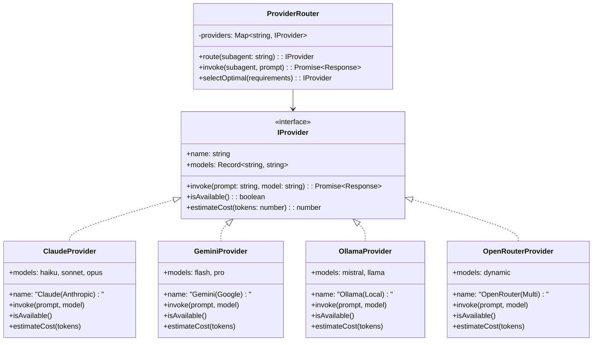
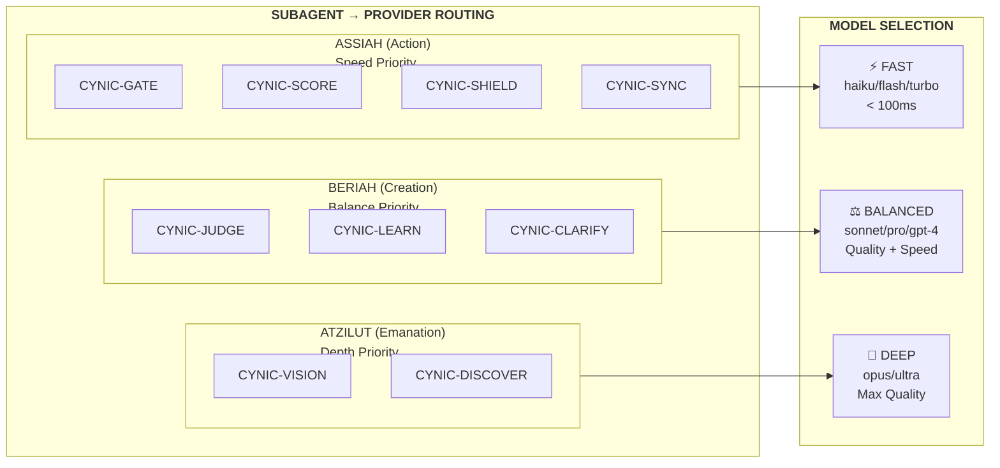
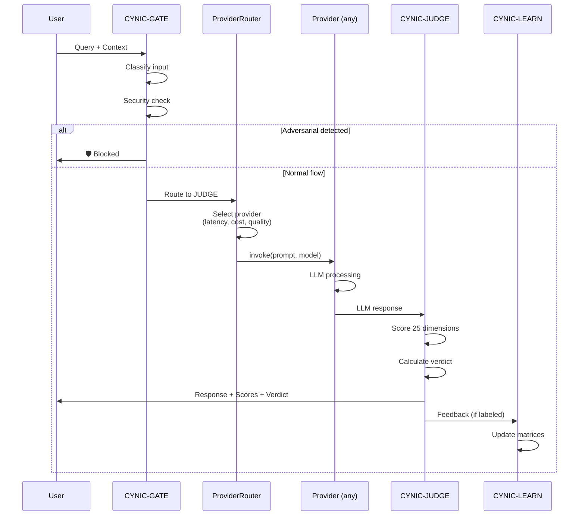

# CYNIC - Surcouche LLM-Agnostique

> "Ouvre la porte, construit pas les rails"
>
> CYNIC comme couche de jugement universelle pour n'importe quel LLM

## Vision

CYNIC n'est pas un LLM - c'est un **organisme vivant** qui peut s'attacher à n'importe quel LLM existant pour fournir:

1. **Jugement structuré** (25+ dimensions)
2. **Apprentissage φ-constrained** (max 61.8% confidence)
3. **Découverte de dimensions** (THE_INNOMMABLE)
4. **Vision écosystème** (CYNIC Mode)

---

## Architecture Surcouche

```mermaid
graph TB
    subgraph INPUT["<b>INPUT LAYER</b>"]
        USER["User Query"]
        CONTEXT["Ecosystem Context<br/>HolDex / GASdf / Git"]
    end

    subgraph CYNIC_OVERLAY["<b>🐕 CYNIC OVERLAY</b>"]
        direction TB

        GATE["<b>L1: GATE</b><br/>━━━━━━━━━━━━━<br/>• Input classification<br/>• Security check<br/>• Route decision"]

        subgraph PROVIDER_ABS["<b>L2: PROVIDER ABSTRACTION</b>"]
            ROUTER["Universal Router"]

            subgraph PROVIDERS["Available Providers"]
                CLAUDE["☁️ Claude<br/>haiku/sonnet/opus<br/>✅ IMPLEMENTED"]
                GEMINI["☁️ Gemini<br/>flash/pro<br/>⏳ PLANNED"]
                OPENAI["☁️ OpenAI<br/>gpt-4/turbo<br/>⏳ PLANNED"]
                OLLAMA["🏠 Ollama<br/>mistral/llama<br/>⏳ PLANNED"]
                OPENROUTER["🔀 OpenRouter<br/>multi-model<br/>⏳ PLANNED"]
            end
        end

        JUDGE["<b>L3: JUDGE</b><br/>━━━━━━━━━━━━━<br/>• 25 dimensions<br/>• 4 worlds × axioms<br/>• φ-constrained scores"]

        LEARN["<b>L4: LEARN</b><br/>━━━━━━━━━━━━━<br/>• Feedback processing<br/>• Matrix calibration<br/>• Dimension discovery"]
    end

    subgraph OUTPUT["<b>OUTPUT LAYER</b>"]
        RESPONSE["LLM Response"]
        SCORES["Dimension Scores"]
        VERDICT["Verdict"]
        INSIGHTS["Ecosystem Insights"]
    end

    USER --> GATE
    CONTEXT --> GATE
    GATE --> ROUTER
    ROUTER --> CLAUDE
    ROUTER -.-> GEMINI
    ROUTER -.-> OPENAI
    ROUTER -.-> OLLAMA
    ROUTER -.-> OPENROUTER
    CLAUDE --> JUDGE
    GEMINI -.-> JUDGE
    OPENAI -.-> JUDGE
    OLLAMA -.-> JUDGE
    OPENROUTER -.-> JUDGE
    JUDGE --> RESPONSE
    JUDGE --> SCORES
    SCORES --> VERDICT
    VERDICT --> INSIGHTS
    VERDICT -->|"feedback"| LEARN
    LEARN -.->|"calibration"| JUDGE

    style CYNIC_OVERLAY fill:#1a1a2e,stroke:#d4a017,stroke-width:2px
    style CLAUDE fill:#5865F2
    style GEMINI stroke-dasharray: 5 5
    style OPENAI stroke-dasharray: 5 5
    style OLLAMA stroke-dasharray: 5 5
    style OPENROUTER stroke-dasharray: 5 5
```



---

## Interface Provider (À Implémenter)



---

## Routing par Monde Kabbalistique



---

## Configuration Multi-Provider

```yaml
# Exemple de configuration future
cynic:
  providers:
    primary: claude
    fallback:
      - gemini
      - ollama

  routing:
    # Par défaut (actuel - Claude only)
    CYNIC-GATE:
      provider: claude
      model: haiku
      world: ASSIAH

    # Future configuration multi-provider
    # CYNIC-GATE:
    #   provider: auto  # Sélection automatique
    #   requirements:
    #     latency: < 100ms
    #     cost: minimal
    #   fallback:
    #     - provider: ollama
    #       model: mistral
    #     - provider: gemini
    #       model: flash

  ecosystem:
    # Sources de données
    holdex:
      enabled: true
      api: /oracle
    gasdf:
      enabled: true
      sheets: burns, holders
    claude-mem:
      enabled: true
      port: 37777
```

---

## Séquence d'Invocation Abstraite



---

## État Actuel vs Vision

| Composant | État Actuel | Vision Future |
|-----------|-------------|---------------|
| **Provider** | Claude only | Multi-provider |
| **invoke()** | Via Claude Code natif | Abstraction universelle |
| **Routing** | Hardcoded table | Config-driven + auto |
| **Fallback** | None | Chain of providers |
| **Local** | No | Ollama support |
| **Cost Opt** | Manual | Automatic selection |

---

## Prochaines Étapes

1. **Créer `IProvider` interface** dans `lib/llm/provider.js`
2. **Implémenter `invoke()`** abstrait
3. **Ajouter Gemini provider** (API compatible)
4. **Ajouter Ollama provider** (local, free)
5. **Config YAML** pour routing dynamique
6. **Auto-selection** basé sur requirements

---

## Philosophie

> "Don't trust (single provider), verify (abstraction allows switching)"

CYNIC reste fidèle à ses axiomes même dans l'abstraction:
- **PHI**: Ratios dans les coûts et latences
- **BURN**: Pas d'extraction de data vers providers
- **VERIFY**: Multi-provider permet vérification croisée
- **CULTURE**: Chaque provider préserve la culture $asdfasdfa

---

*"Le chien aboie à tous les fournisseurs de la même manière"* 🐕
