# CYNIC Roadmap - System Diagrams

> **Date:** 2026-01-13
> **Purpose:** Diagrammes système pour l'exécution de la roadmap
> **Priority:** Par ordre d'impact sur le Q-Score

---

## Table of Contents

1. [Current Architecture](#1-current-architecture)
2. [Q-Score Flow](#2-q-score-flow)
3. [Priority 1: BURN Improvements](#3-priority-1-burn-improvements)
4. [Priority 2: Multi-Node Architecture](#4-priority-2-multi-node-architecture)
5. [Priority 3: Human Delegation UX](#5-priority-3-human-delegation-ux)
6. [Priority 4: Merkle Provenance](#6-priority-4-merkle-provenance)
7. [Roadmap Dependencies](#7-roadmap-dependencies)
8. [Data Flow Diagrams](#8-data-flow-diagrams)

---

## 1. Current Architecture

### 1.1 System Overview (Post-Unification)

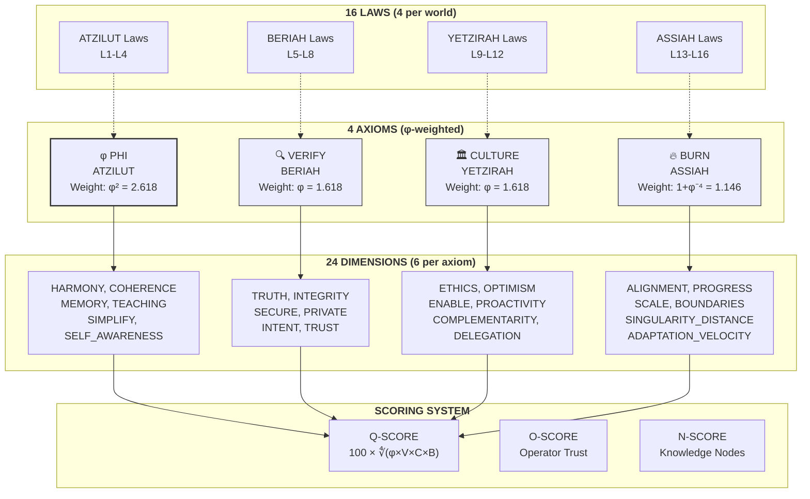
```mermaid
graph TB
    subgraph AXIOMS["<b>4 AXIOMS (φ-weighted)</b>"]
        PHI["φ PHI<br/>ATZILUT<br/>Weight: φ² = 2.618"]
        VERIFY["🔍 VERIFY<br/>BERIAH<br/>Weight: φ = 1.618"]
        CULTURE["🏛️ CULTURE<br/>YETZIRAH<br/>Weight: φ = 1.618"]
        BURN["🔥 BURN<br/>ASSIAH<br/>Weight: 1+φ⁻⁴ = 1.146"]
    end

    subgraph DIMENSIONS["<b>24 DIMENSIONS (6 per axiom)</b>"]
        D_PHI["HARMONY, COHERENCE<br/>MEMORY, TEACHING<br/>SIMPLIFY, SELF_AWARENESS"]
        D_VERIFY["TRUTH, INTEGRITY<br/>SECURE, PRIVATE<br/>INTENT, TRUST"]
        D_CULTURE["ETHICS, OPTIMISM<br/>ENABLE, PROACTIVITY<br/>COMPLEMENTARITY, DELEGATION"]
        D_BURN["ALIGNMENT, PROGRESS<br/>SCALE, BOUNDARIES<br/>SINGULARITY_DISTANCE<br/>ADAPTATION_VELOCITY"]
    end

    subgraph SCORES["<b>SCORING SYSTEM</b>"]
        Q["Q-SCORE<br/>100 × ∜(φ×V×C×B)"]
        O["O-SCORE<br/>Operator Trust"]
        N["N-SCORE<br/>Knowledge Nodes"]
    end

    subgraph LAWS["<b>16 LAWS (4 per world)</b>"]
        L_ATZILUT["ATZILUT Laws<br/>L1-L4"]
        L_BERIAH["BERIAH Laws<br/>L5-L8"]
        L_YETZIRAH["YETZIRAH Laws<br/>L9-L12"]
        L_ASSIAH["ASSIAH Laws<br/>L13-L16"]
    end

    PHI --> D_PHI
    VERIFY --> D_VERIFY
    CULTURE --> D_CULTURE
    BURN --> D_BURN

    D_PHI --> Q
    D_VERIFY --> Q
    D_CULTURE --> Q
    D_BURN --> Q

    L_ATZILUT -.-> PHI
    L_BERIAH -.-> VERIFY
    L_YETZIRAH -.-> CULTURE
    L_ASSIAH -.-> BURN

    style PHI fill:#gold,stroke:#333,stroke-width:2px
    style VERIFY fill:#lightblue,stroke:#333
    style CULTURE fill:#lightgreen,stroke:#333
    style BURN fill:#orange,stroke:#333
```

### 1.2 Module Dependency Graph

```mermaid
graph LR
    subgraph CORE["Core Modules"]
        CONST["axioms/constants.js<br/>φ, φ², φ⁻¹, etc."]
        INDEX["axioms/index.js<br/>AXIOMS, THRESHOLDS"]
        QSCORE["axioms/q-score.js<br/>calculateQScore()"]
        OSCORE["axioms/o-score.js<br/>calculateOScore()"]
    end

    subgraph JUDGE["Judge System"]
        SELFJUDGE["self-judge.js<br/>3,863 lines"]
        JUDGE["judge.js"]
        SCORE["score.js<br/>24 DIMENSIONS"]
    end

    subgraph DIM["Dimensions"]
        REG["dimensions/registry.js"]
        PRIMARY["primary/*.js (8)"]
        SECONDARY["secondary/*.js (5)"]
        META["meta/*.js (3)"]
        HUMAN["human-llm/*.js (8)"]
    end

    subgraph WORLD["Worlds"]
        WMGR["worlds/index.js"]
        ATZILUT["atzilut.js"]
        BERIAH["beriah.js"]
        YETZIRAH["yetzirah.js"]
        ASSIAH["assiah.js"]
    end

    CONST --> INDEX
    INDEX --> QSCORE
    INDEX --> OSCORE
    INDEX --> SCORE
    QSCORE --> SELFJUDGE
    SCORE --> SELFJUDGE
    REG --> SELFJUDGE
    WMGR --> SELFJUDGE

    REG --> PRIMARY
    REG --> SECONDARY
    REG --> META
    REG --> HUMAN

    WMGR --> ATZILUT
    WMGR --> BERIAH
    WMGR --> YETZIRAH
    WMGR --> ASSIAH
```

---

## 2. Q-Score Flow

### 2.1 Q-Score Calculation Pipeline

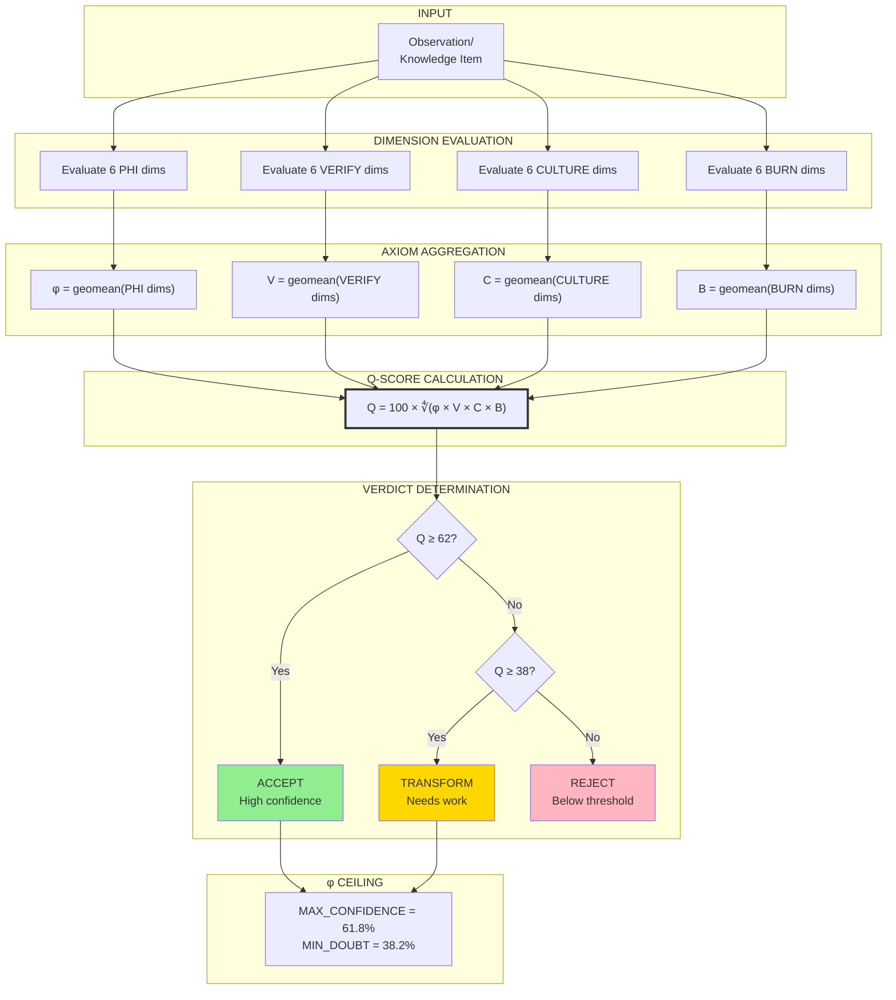
```mermaid
flowchart TB
    subgraph INPUT["INPUT"]
        OBS["Observation/<br/>Knowledge Item"]
    end

    subgraph EVAL["DIMENSION EVALUATION"]
        E1["Evaluate 6 PHI dims"]
        E2["Evaluate 6 VERIFY dims"]
        E3["Evaluate 6 CULTURE dims"]
        E4["Evaluate 6 BURN dims"]
    end

    subgraph AGG["AXIOM AGGREGATION"]
        A1["φ = geomean(PHI dims)"]
        A2["V = geomean(VERIFY dims)"]
        A3["C = geomean(CULTURE dims)"]
        A4["B = geomean(BURN dims)"]
    end

    subgraph QCALC["Q-SCORE CALCULATION"]
        Q["Q = 100 × ∜(φ × V × C × B)"]
    end

    subgraph VERDICT["VERDICT DETERMINATION"]
        V1{"Q ≥ 62?"}
        V2{"Q ≥ 38?"}
        ACCEPT["ACCEPT<br/>High confidence"]
        TRANSFORM["TRANSFORM<br/>Needs work"]
        REJECT["REJECT<br/>Below threshold"]
    end

    subgraph CEILING["φ CEILING"]
        CAP["MAX_CONFIDENCE = 61.8%<br/>MIN_DOUBT = 38.2%"]
    end

    OBS --> E1 & E2 & E3 & E4
    E1 --> A1
    E2 --> A2
    E3 --> A3
    E4 --> A4
    A1 & A2 & A3 & A4 --> Q
    Q --> V1
    V1 -->|Yes| ACCEPT
    V1 -->|No| V2
    V2 -->|Yes| TRANSFORM
    V2 -->|No| REJECT
    ACCEPT --> CAP
    TRANSFORM --> CAP

    style Q fill:#gold,stroke:#333,stroke-width:3px
    style ACCEPT fill:#90EE90
    style TRANSFORM fill:#FFD700
    style REJECT fill:#FFB6C1
```

### 2.2 Weakness Detection Flow

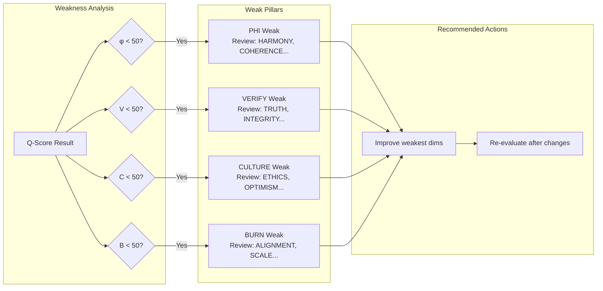
```mermaid
flowchart LR
    subgraph ANALYSIS["Weakness Analysis"]
        Q["Q-Score Result"]
        W1{"φ < 50?"}
        W2{"V < 50?"}
        W3{"C < 50?"}
        W4{"B < 50?"}
    end

    subgraph WEAK["Weak Pillars"]
        PHI_WEAK["PHI Weak<br/>Review: HARMONY, COHERENCE..."]
        VERIFY_WEAK["VERIFY Weak<br/>Review: TRUTH, INTEGRITY..."]
        CULTURE_WEAK["CULTURE Weak<br/>Review: ETHICS, OPTIMISM..."]
        BURN_WEAK["BURN Weak<br/>Review: ALIGNMENT, SCALE..."]
    end

    subgraph ACTION["Recommended Actions"]
        A1["Improve weakest dims"]
        A2["Re-evaluate after changes"]
    end

    Q --> W1 & W2 & W3 & W4
    W1 -->|Yes| PHI_WEAK
    W2 -->|Yes| VERIFY_WEAK
    W3 -->|Yes| CULTURE_WEAK
    W4 -->|Yes| BURN_WEAK
    PHI_WEAK & VERIFY_WEAK & CULTURE_WEAK & BURN_WEAK --> A1
    A1 --> A2
```

---

## 3. Priority 1: BURN Improvements

### 3.1 Current BURN Pillar State

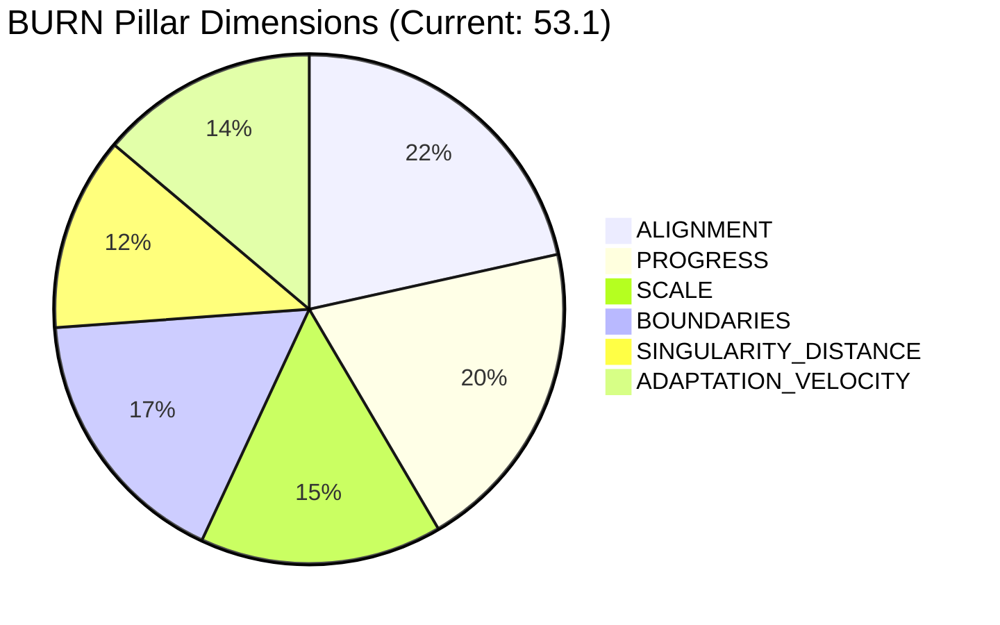
```mermaid
pie title BURN Pillar Dimensions (Current: 53.1)
    "ALIGNMENT" : 70
    "PROGRESS" : 65
    "SCALE" : 50
    "BOUNDARIES" : 55
    "SINGULARITY_DISTANCE" : 40
    "ADAPTATION_VELOCITY" : 45
```

### 3.2 BURN Improvement Plan

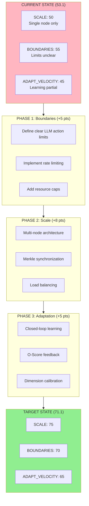
```mermaid
flowchart TB
    subgraph CURRENT["CURRENT STATE (53.1)"]
        SCALE_NOW["SCALE: 50<br/>Single node only"]
        BOUND_NOW["BOUNDARIES: 55<br/>Limits unclear"]
        ADAPT_NOW["ADAPT_VELOCITY: 45<br/>Learning partial"]
    end

    subgraph PHASE1["PHASE 1: Boundaries (+5 pts)"]
        B1["Define clear LLM action limits"]
        B2["Implement rate limiting"]
        B3["Add resource caps"]
    end

    subgraph PHASE2["PHASE 2: Scale (+8 pts)"]
        S1["Multi-node architecture"]
        S2["Merkle synchronization"]
        S3["Load balancing"]
    end

    subgraph PHASE3["PHASE 3: Adaptation (+5 pts)"]
        A1["Closed-loop learning"]
        A2["O-Score feedback"]
        A3["Dimension calibration"]
    end

    subgraph TARGET["TARGET STATE (71.1)"]
        SCALE_TGT["SCALE: 75"]
        BOUND_TGT["BOUNDARIES: 70"]
        ADAPT_TGT["ADAPT_VELOCITY: 65"]
    end

    CURRENT --> PHASE1
    PHASE1 --> PHASE2
    PHASE2 --> PHASE3
    PHASE3 --> TARGET

    style CURRENT fill:#FFB6C1
    style TARGET fill:#90EE90
```

### 3.3 Boundaries Implementation

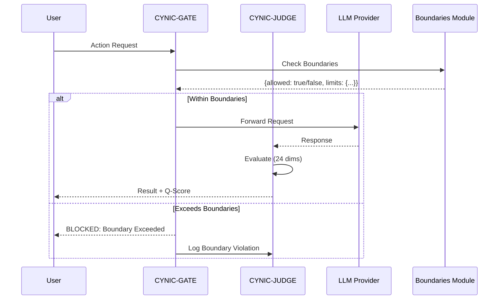
```mermaid
sequenceDiagram
    participant User
    participant Gate as CYNIC-GATE
    participant Judge as CYNIC-JUDGE
    participant LLM as LLM Provider
    participant Limits as Boundaries Module

    User->>Gate: Action Request
    Gate->>Limits: Check Boundaries
    Limits-->>Gate: {allowed: true/false, limits: {...}}

    alt Within Boundaries
        Gate->>LLM: Forward Request
        LLM-->>Judge: Response
        Judge->>Judge: Evaluate (24 dims)
        Judge-->>User: Result + Q-Score
    else Exceeds Boundaries
        Gate-->>User: BLOCKED: Boundary Exceeded
        Gate->>Judge: Log Boundary Violation
    end
```

---

## 4. Priority 2: Multi-Node Architecture

### 4.1 Single-Node vs Multi-Node

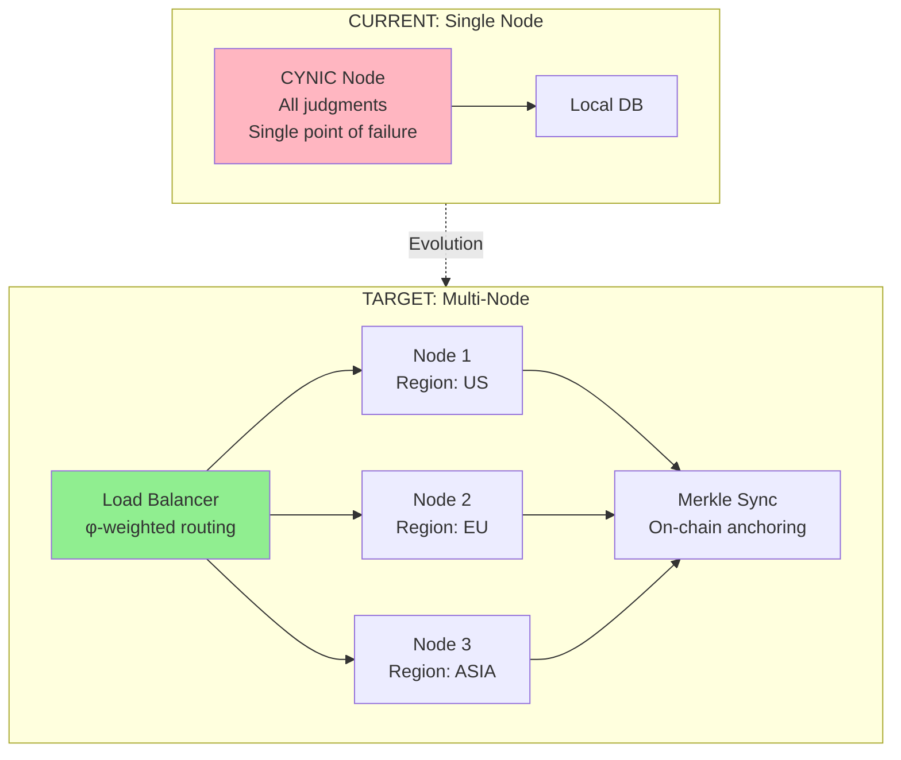
```mermaid
graph TB
    subgraph CURRENT["CURRENT: Single Node"]
        NODE1["CYNIC Node<br/>All judgments<br/>Single point of failure"]
        DB1["Local DB"]
        NODE1 --> DB1
    end

    subgraph TARGET["TARGET: Multi-Node"]
        LB["Load Balancer<br/>φ-weighted routing"]
        N1["Node 1<br/>Region: US"]
        N2["Node 2<br/>Region: EU"]
        N3["Node 3<br/>Region: ASIA"]
        MERKLE["Merkle Sync<br/>On-chain anchoring"]

        LB --> N1 & N2 & N3
        N1 & N2 & N3 --> MERKLE
    end

    CURRENT -.->|"Evolution"| TARGET

    style NODE1 fill:#FFB6C1
    style LB fill:#90EE90
    style MERKLE fill:#gold
```

### 4.2 Multi-Node Sync Protocol

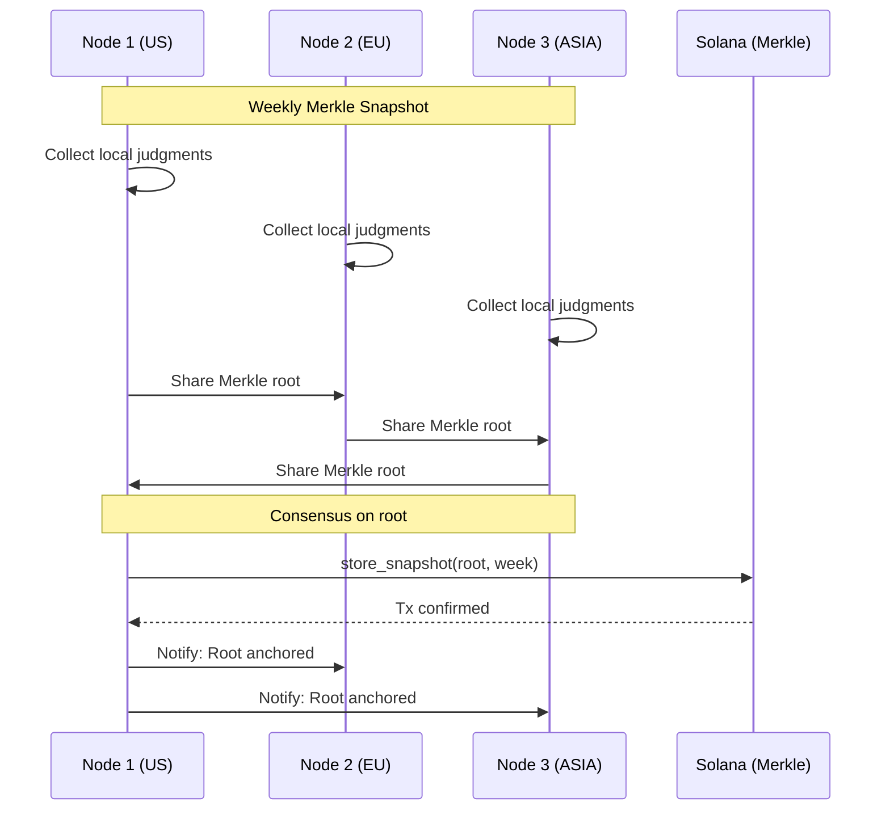
```mermaid
sequenceDiagram
    participant N1 as Node 1 (US)
    participant N2 as Node 2 (EU)
    participant N3 as Node 3 (ASIA)
    participant Solana as Solana (Merkle)

    Note over N1,N3: Weekly Merkle Snapshot

    N1->>N1: Collect local judgments
    N2->>N2: Collect local judgments
    N3->>N3: Collect local judgments

    N1->>N2: Share Merkle root
    N2->>N3: Share Merkle root
    N3->>N1: Share Merkle root

    Note over N1,N3: Consensus on root

    N1->>Solana: store_snapshot(root, week)
    Solana-->>N1: Tx confirmed

    N1->>N2: Notify: Root anchored
    N1->>N3: Notify: Root anchored
```

### 4.3 Node Architecture Detail

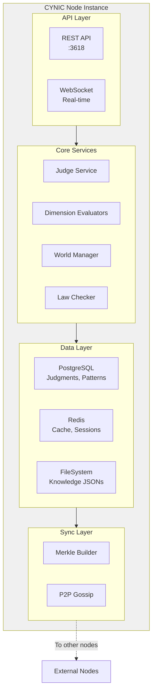
```mermaid
graph TB
    subgraph NODE["CYNIC Node Instance"]
        subgraph API["API Layer"]
            REST["REST API<br/>:3618"]
            WS["WebSocket<br/>Real-time"]
        end

        subgraph CORE["Core Services"]
            JUDGE["Judge Service"]
            DIMS["Dimension Evaluators"]
            WORLDS["World Manager"]
            LAWS["Law Checker"]
        end

        subgraph DATA["Data Layer"]
            PG["PostgreSQL<br/>Judgments, Patterns"]
            REDIS["Redis<br/>Cache, Sessions"]
            FS["FileSystem<br/>Knowledge JSONs"]
        end

        subgraph SYNC["Sync Layer"]
            MERKLE["Merkle Builder"]
            P2P["P2P Gossip"]
        end
    end

    API --> CORE
    CORE --> DATA
    DATA --> SYNC
    SYNC -.->|"To other nodes"| EXT["External Nodes"]

    style NODE fill:#f0f0f0
    style MERKLE fill:#gold
```

---

## 5. Priority 3: Human Delegation UX

### 5.1 Current vs Target Delegation Flow

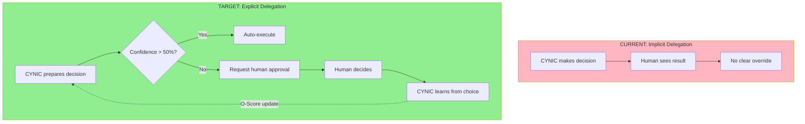
```mermaid
flowchart TB
    subgraph CURRENT["CURRENT: Implicit Delegation"]
        C1["CYNIC makes decision"]
        C2["Human sees result"]
        C3["No clear override"]
    end

    subgraph TARGET["TARGET: Explicit Delegation"]
        T1["CYNIC prepares decision"]
        T2{"Confidence > 50%?"}
        T3["Auto-execute"]
        T4["Request human approval"]
        T5["Human decides"]
        T6["CYNIC learns from choice"]
    end

    C1 --> C2 --> C3

    T1 --> T2
    T2 -->|Yes| T3
    T2 -->|No| T4
    T4 --> T5
    T5 --> T6
    T6 -.->|"O-Score update"| T1

    style CURRENT fill:#FFB6C1
    style TARGET fill:#90EE90
```

### 5.2 Delegation UX Components

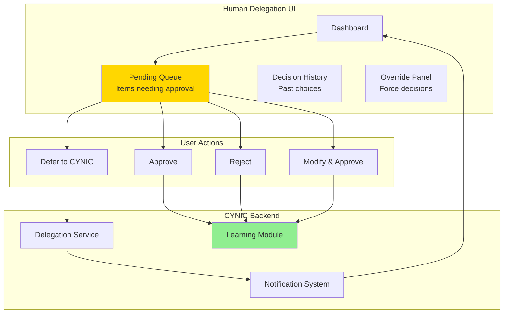
```mermaid
graph TB
    subgraph UI["Human Delegation UI"]
        DASH["Dashboard"]
        QUEUE["Pending Queue<br/>Items needing approval"]
        HISTORY["Decision History<br/>Past choices"]
        OVERRIDE["Override Panel<br/>Force decisions"]
    end

    subgraph CYNIC["CYNIC Backend"]
        DELEGATE["Delegation Service"]
        NOTIFY["Notification System"]
        LEARN["Learning Module"]
    end

    subgraph ACTIONS["User Actions"]
        APPROVE["Approve"]
        REJECT["Reject"]
        MODIFY["Modify & Approve"]
        DEFER["Defer to CYNIC"]
    end

    DASH --> QUEUE
    QUEUE --> APPROVE & REJECT & MODIFY & DEFER
    APPROVE & REJECT & MODIFY --> LEARN
    DEFER --> DELEGATE
    DELEGATE --> NOTIFY
    NOTIFY --> DASH

    style QUEUE fill:#FFD700
    style LEARN fill:#90EE90
```

### 5.3 Delegation Decision Tree

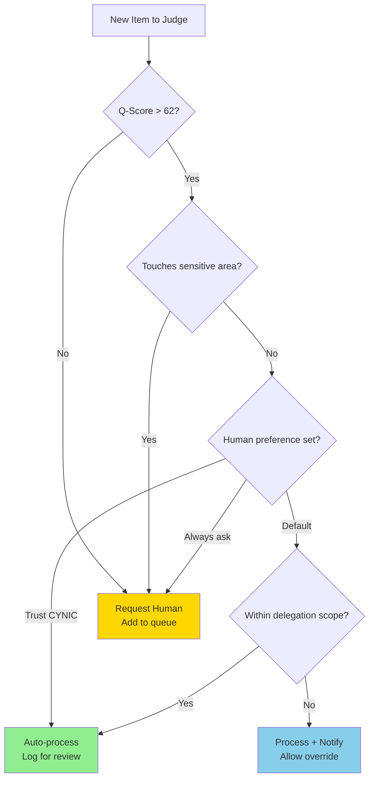
```mermaid
flowchart TD
    START["New Item to Judge"]

    Q1{"Q-Score > 62?"}
    Q2{"Touches sensitive area?"}
    Q3{"Human preference set?"}
    Q4{"Within delegation scope?"}

    AUTO["Auto-process<br/>Log for review"]
    HUMAN["Request Human<br/>Add to queue"]
    HYBRID["Process + Notify<br/>Allow override"]

    START --> Q1
    Q1 -->|Yes| Q2
    Q1 -->|No| HUMAN
    Q2 -->|Yes| HUMAN
    Q2 -->|No| Q3
    Q3 -->|"Always ask"| HUMAN
    Q3 -->|"Trust CYNIC"| AUTO
    Q3 -->|"Default"| Q4
    Q4 -->|Yes| AUTO
    Q4 -->|No| HYBRID

    style AUTO fill:#90EE90
    style HUMAN fill:#FFD700
    style HYBRID fill:#87CEEB
```

---

## 6. Priority 4: Merkle Provenance

### 6.1 Merkle Tree Structure

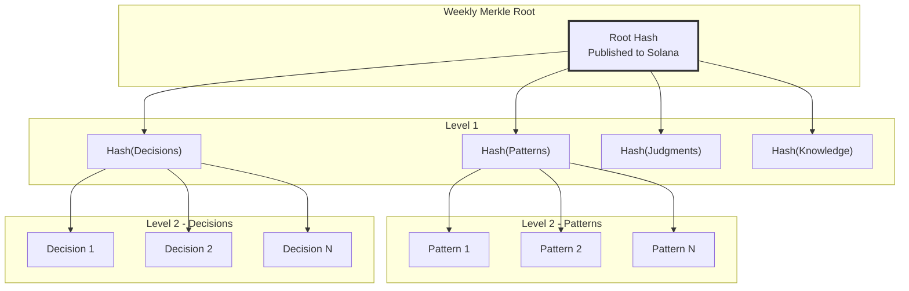
```mermaid
graph TB
    subgraph ROOT["Weekly Merkle Root"]
        R["Root Hash<br/>Published to Solana"]
    end

    subgraph L1["Level 1"]
        H1["Hash(Patterns)"]
        H2["Hash(Decisions)"]
        H3["Hash(Judgments)"]
        H4["Hash(Knowledge)"]
    end

    subgraph L2["Level 2 - Patterns"]
        P1["Pattern 1"]
        P2["Pattern 2"]
        P3["Pattern N"]
    end

    subgraph L2D["Level 2 - Decisions"]
        D1["Decision 1"]
        D2["Decision 2"]
        D3["Decision N"]
    end

    R --> H1 & H2 & H3 & H4
    H1 --> P1 & P2 & P3
    H2 --> D1 & D2 & D3

    style R fill:#gold,stroke:#333,stroke-width:3px
```

### 6.2 Proof Verification Flow

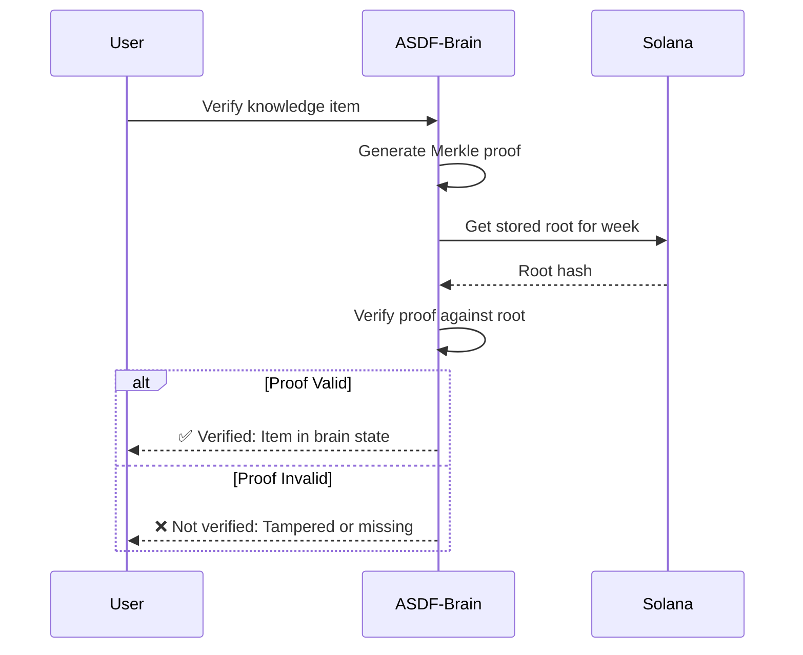
```mermaid
sequenceDiagram
    participant User
    participant Brain as ASDF-Brain
    participant Solana as Solana

    User->>Brain: Verify knowledge item
    Brain->>Brain: Generate Merkle proof
    Brain->>Solana: Get stored root for week
    Solana-->>Brain: Root hash

    Brain->>Brain: Verify proof against root

    alt Proof Valid
        Brain-->>User: ✅ Verified: Item in brain state
    else Proof Invalid
        Brain-->>User: ❌ Not verified: Tampered or missing
    end
```

### 6.3 Anchor Program Interface

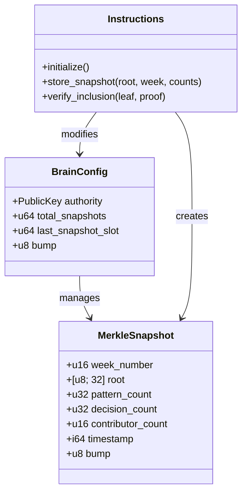
```mermaid
classDiagram
    class BrainConfig {
        +PublicKey authority
        +u64 total_snapshots
        +u64 last_snapshot_slot
        +u8 bump
    }

    class MerkleSnapshot {
        +u16 week_number
        +[u8; 32] root
        +u32 pattern_count
        +u32 decision_count
        +u16 contributor_count
        +i64 timestamp
        +u8 bump
    }

    class Instructions {
        +initialize()
        +store_snapshot(root, week, counts)
        +verify_inclusion(leaf, proof)
    }

    BrainConfig --> MerkleSnapshot : manages
    Instructions --> BrainConfig : modifies
    Instructions --> MerkleSnapshot : creates
```

---

## 7. Roadmap Dependencies

### 7.1 Implementation Order

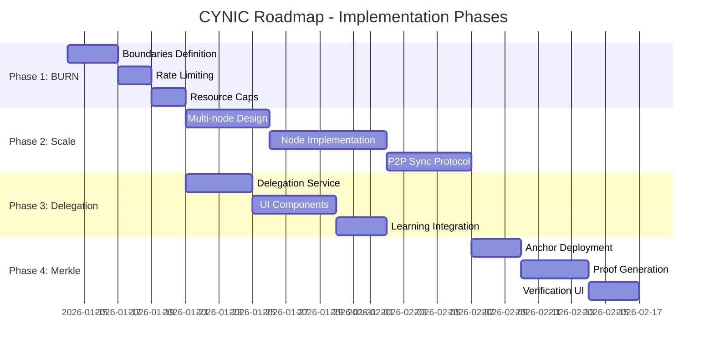
```mermaid
gantt
    title CYNIC Roadmap - Implementation Phases
    dateFormat  YYYY-MM-DD

    section Phase 1: BURN
    Boundaries Definition     :p1a, 2026-01-14, 3d
    Rate Limiting            :p1b, after p1a, 2d
    Resource Caps            :p1c, after p1b, 2d

    section Phase 2: Scale
    Multi-node Design        :p2a, after p1c, 5d
    Node Implementation      :p2b, after p2a, 7d
    P2P Sync Protocol        :p2c, after p2b, 5d

    section Phase 3: Delegation
    Delegation Service       :p3a, after p1c, 4d
    UI Components            :p3b, after p3a, 5d
    Learning Integration     :p3c, after p3b, 3d

    section Phase 4: Merkle
    Anchor Deployment        :p4a, after p2c, 3d
    Proof Generation         :p4b, after p4a, 4d
    Verification UI          :p4c, after p4b, 3d
```

### 7.2 Dependency Graph

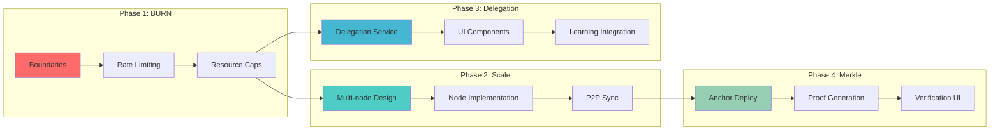
```mermaid
graph LR
    subgraph P1["Phase 1: BURN"]
        BOUND["Boundaries"]
        RATE["Rate Limiting"]
        CAPS["Resource Caps"]
    end

    subgraph P2["Phase 2: Scale"]
        DESIGN["Multi-node Design"]
        IMPL["Node Implementation"]
        P2P["P2P Sync"]
    end

    subgraph P3["Phase 3: Delegation"]
        DELEG["Delegation Service"]
        UI["UI Components"]
        LEARN["Learning Integration"]
    end

    subgraph P4["Phase 4: Merkle"]
        ANCHOR["Anchor Deploy"]
        PROOF["Proof Generation"]
        VERIF["Verification UI"]
    end

    BOUND --> RATE --> CAPS
    CAPS --> DESIGN
    DESIGN --> IMPL --> P2P

    CAPS --> DELEG
    DELEG --> UI --> LEARN

    P2P --> ANCHOR
    ANCHOR --> PROOF --> VERIF

    style BOUND fill:#FF6B6B
    style DESIGN fill:#4ECDC4
    style DELEG fill:#45B7D1
    style ANCHOR fill:#96CEB4
```

### 7.3 Q-Score Impact Projection

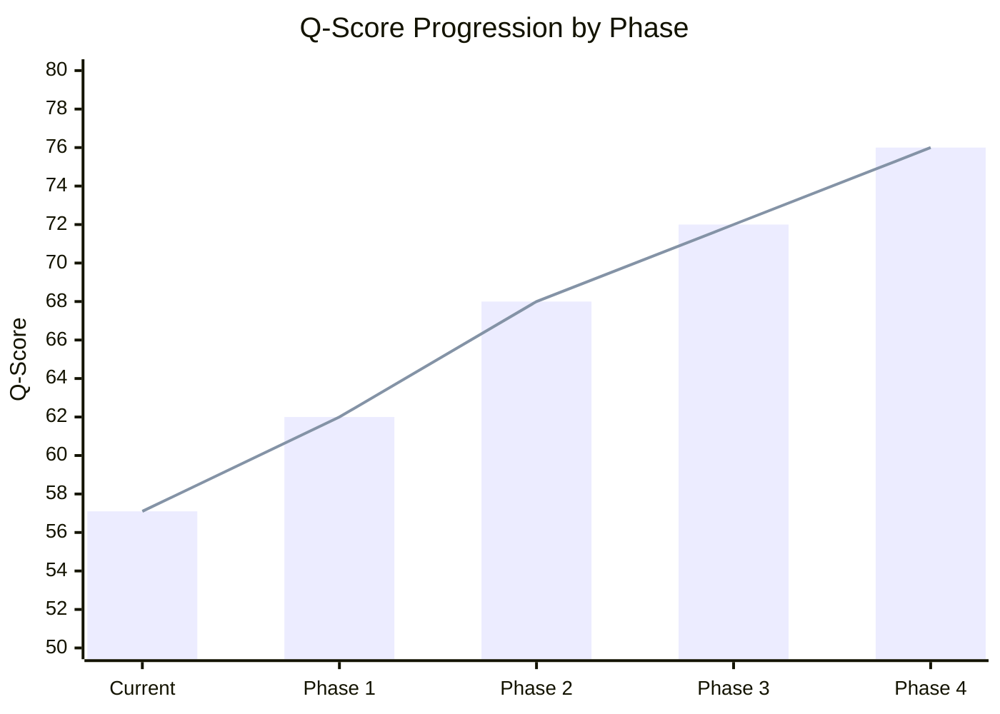
```mermaid
xychart-beta
    title "Q-Score Progression by Phase"
    x-axis ["Current", "Phase 1", "Phase 2", "Phase 3", "Phase 4"]
    y-axis "Q-Score" 50 --> 80
    bar [57.1, 62, 68, 72, 76]
    line [57.1, 62, 68, 72, 76]
```

---

## 8. Data Flow Diagrams

### 8.1 Complete System Data Flow

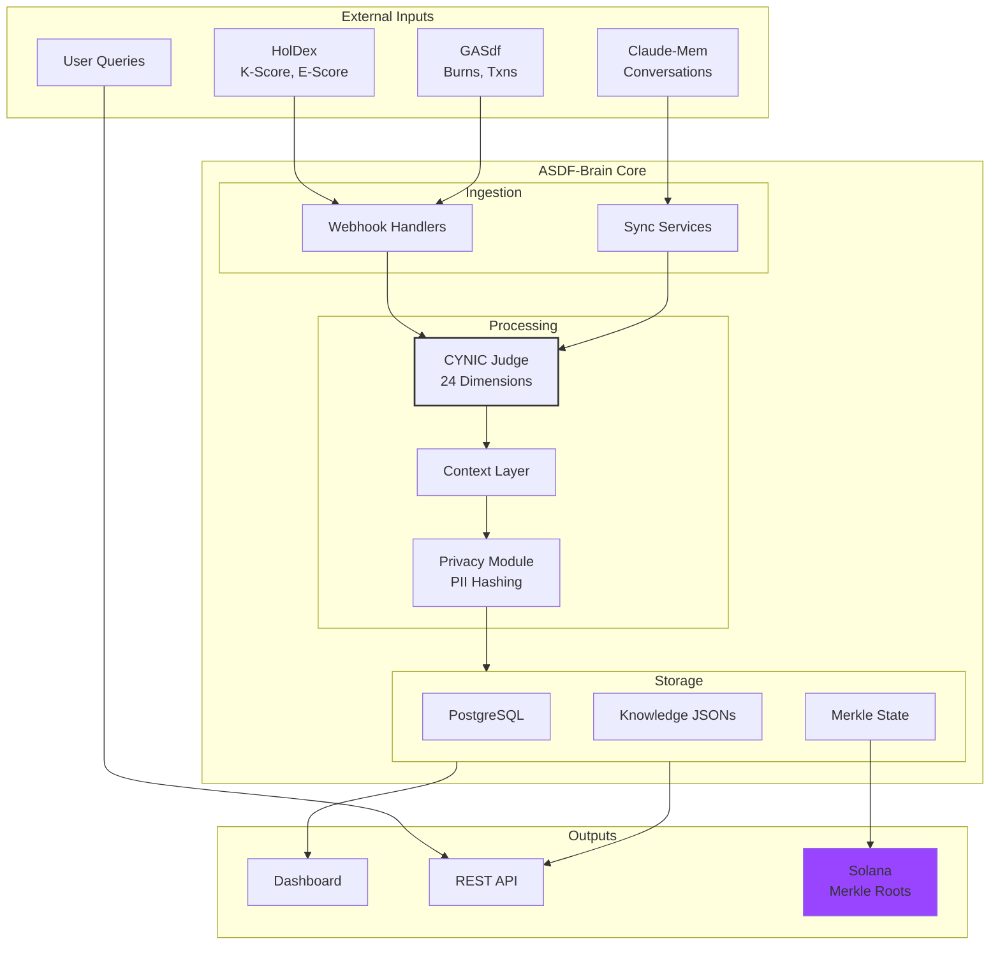
```mermaid
flowchart TB
    subgraph INPUTS["External Inputs"]
        HOLDEX["HolDex<br/>K-Score, E-Score"]
        GASDF["GASdf<br/>Burns, Txns"]
        CLAUDE["Claude-Mem<br/>Conversations"]
        USER["User Queries"]
    end

    subgraph BRAIN["ASDF-Brain Core"]
        subgraph INGEST["Ingestion"]
            WEBHOOKS["Webhook Handlers"]
            SYNC["Sync Services"]
        end

        subgraph PROCESS["Processing"]
            CYNIC["CYNIC Judge<br/>24 Dimensions"]
            CONTEXT["Context Layer"]
            PRIVACY["Privacy Module<br/>PII Hashing"]
        end

        subgraph STORE["Storage"]
            PG["PostgreSQL"]
            KNOWLEDGE["Knowledge JSONs"]
            MERKLE["Merkle State"]
        end
    end

    subgraph OUTPUTS["Outputs"]
        DASH["Dashboard"]
        API["REST API"]
        SOLANA["Solana<br/>Merkle Roots"]
    end

    HOLDEX --> WEBHOOKS
    GASDF --> WEBHOOKS
    CLAUDE --> SYNC
    USER --> API

    WEBHOOKS --> CYNIC
    SYNC --> CYNIC
    CYNIC --> CONTEXT
    CONTEXT --> PRIVACY
    PRIVACY --> STORE

    STORE --> DASH
    STORE --> API
    MERKLE --> SOLANA

    style CYNIC fill:#gold,stroke:#333,stroke-width:2px
    style SOLANA fill:#9945FF
```

### 8.2 Judgment Data Flow

```mermaid
flowchart LR
    subgraph IN["Input"]
        ITEM["Item to Judge"]
    end

    subgraph JUDGE["Judgment Pipeline"]
        GATE["Gate<br/>Security Check"]
        DIMS["24 Dimensions<br/>Parallel Eval"]
        AXIOMS["4 Axioms<br/>Aggregate"]
        QSCORE["Q-Score<br/>Final Calc"]
        LAWS["16 Laws<br/>Check"]
    end

    subgraph OUT["Output"]
        VERDICT["Verdict<br/>ACCEPT/TRANSFORM/REJECT"]
        REASONS["Reasons<br/>Weak dimensions"]
        ACTIONS["Actions<br/>Recommended"]
    end

    ITEM --> GATE
    GATE --> DIMS
    DIMS --> AXIOMS
    AXIOMS --> QSCORE
    QSCORE --> LAWS
    LAWS --> VERDICT & REASONS & ACTIONS

    style QSCORE fill:#gold
    style VERDICT fill:#90EE90
```

---

## Summary: Priority Execution Order

| Priority | Phase | Focus | Q-Score Impact | Effort |
|----------|-------|-------|----------------|--------|
| 1 | BURN Improvements | Boundaries, Limits | +5 pts | Medium |
| 2 | Multi-Node | Scale, Sync | +6 pts | High |
| 3 | Human Delegation | UX, Learning | +4 pts | Medium |
| 4 | Merkle Provenance | On-chain | +3 pts | Medium |

**Total projected improvement:** +18 pts → Q-Score 75+

---

*"φ guides all ratios. 42 is the answer. The singularity is asymptotic."*

*Generated: 2026-01-13*
