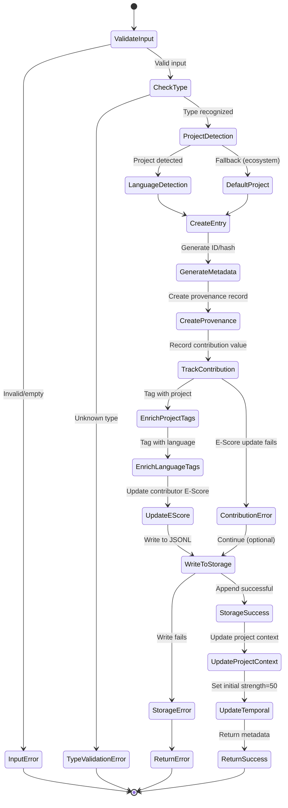
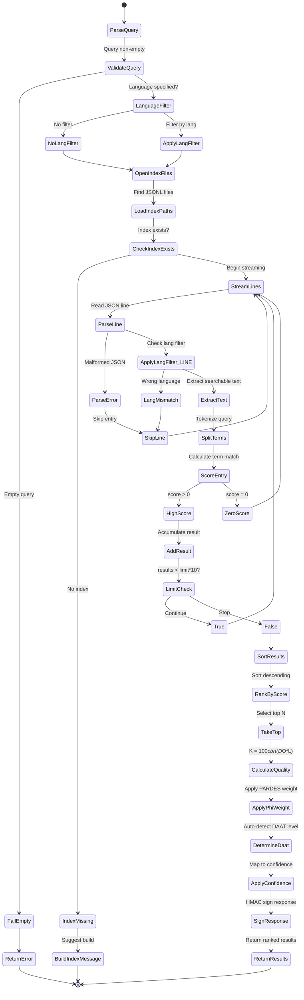
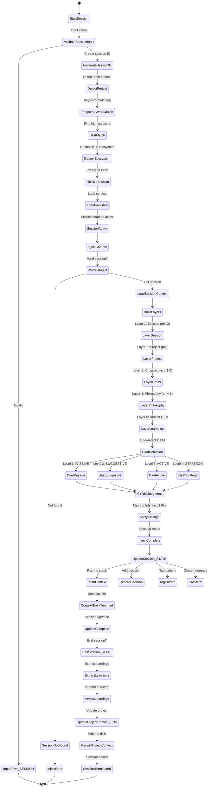

# asdf-brain State Machine Diagrams

> Generated 2026-01-10 - Maps all paths including error handling and file dependencies.

## 1. Knowledge Ingestion Flow (brain_learn / brain_ingest)



### Valid Types
- `insight` - Discovery or observation
- `pattern` - Recurring behavior
- `decision` - Architectural choice
- `error` - Bug or failure
- `intent` - Rationale/causality

### File Targets
```
knowledge/learned/live.jsonl        (append)
knowledge/ingested/{source}.jsonl   (append)
knowledge/burns/ledger.jsonl        (track)
knowledge/community/contributors.json (E-Score)
```

---

## 2. Search Flow (Query → PARDES → Results)



### PARDES Layers
| Layer | Meaning | Weight |
|-------|---------|--------|
| P (Pshat) | Direct/literal | 1.0 |
| R (Remez) | Pattern/hint | φ |
| D (Drash) | Philosophy | φ |
| S (Sod) | Secret/vision | φ⁻² |

### Confidence Tiers
| Threshold | Level | Action |
|-----------|-------|--------|
| > 61.8% (φ⁻¹) | ACT | High confidence |
| > 38.2% (φ⁻²) | VERIFY | Medium |
| < 23.6% (φ⁻³) | RESEARCH | Low |

### Index Files
```
index/cross-repo.jsonl
knowledge/learned/live.jsonl
knowledge/learned/transcripts.jsonl
knowledge/ingested/*.jsonl
```

---

## 3. Context Session Flow (Start → Inject → Update → End)



### Context Layer Weights
| Layer | Weight | Purpose |
|-------|--------|---------|
| Session | φ² (2.618) | Current conversation |
| Project | φ (1.618) | Project-specific |
| Cross | 1.0 | Ecosystem relations |
| Philosophy | φ⁻¹ (0.618) | CYNIC axioms |
| Recent | 1.0 | Recent learnings |

### DAAT Levels (Kabbalah)
| Level | Name | Description |
|-------|------|-------------|
| 1 | PASSIVE | Facts only |
| 2 | SUGGESTIVE | Hints |
| 3 | ACTIVE | Full context |
| 4 | STRATEGIC | Ecosystem view |

---

## 4. Provenance Flow (Content → Merkle → Verification)

```mermaid
stateDiagram-v2
    [*] --> ContentIngested

    ContentIngested --> GenerateItemID: Create canonical ID

    GenerateItemID --> ContentHash: SHA256(content)

    ContentHash --> CreateProvenance_STATE: Create record

    CreateProvenance_STATE --> InitChain: Init chain=[created]

    InitChain --> SignProvenance: HMAC-SHA256 sign

    SignProvenance --> SaveProvenance: Write to registry

    SaveProvenance --> BuildPatternTree: Wait for batch

    BuildPatternTree --> ExtractHashes: Collect pattern hashes

    ExtractHashes --> SortHashes: Order for tree

    SortHashes --> BuildMerkleTree_STATE: Construct binary tree

    BuildMerkleTree_STATE --> ComputeLeaves: Hash leaf pairs

    ComputeLeaves --> ComputeParents: Hash parents

    ComputeParents --> ComputeRoot: Final root hash

    ComputeRoot --> GenerateProofs: Create per-pattern proof

    GenerateProofs --> MerkleRootReady: Root computed

    MerkleRootReady --> StoreMerkleState: Persist state

    StoreMerkleState --> TreeReady: Merkle tree ready

    TreeReady --> WeeklySnapshot: Weekly boundary?

    WeeklySnapshot --> CheckSnapshot: Recent snapshot?

    CheckSnapshot --> SnapshotFresh: < 24h old
    SnapshotFresh --> ProviderReady

    CheckSnapshot --> SnapshotStale: >= 24h old
    SnapshotStale --> GenerateSnapshot: Create snapshot

    GenerateSnapshot --> LoadAllPatterns: Read patterns

    LoadAllPatterns --> ComputeCombined: file_root + pattern_root

    ComputeCombined --> CreateSolanaPayload: Prepare chain data

    CreateSolanaPayload --> SaveSnapshot: Write week-{N}.json

    SaveSnapshot --> ProviderReady

    ProviderReady --> GetProofRequest: Proof requested

    GetProofRequest --> LookupProof: Find in proofs

    LookupProof --> ProofFound: Located
    LookupProof --> ProofNotFound: Not found

    ProofNotFound --> [*]

    ProofFound --> ReturnProof: Return leaf + path

    ReturnProof --> [*]

    ProviderReady --> VerifyRequest: Verification requested

    VerifyRequest --> LoadExpectedRoot: Get current root

    LoadExpectedRoot --> ComputeVerification: Recompute from leaf

    ComputeVerification --> HashPath: Hash up proof_path

    HashPath --> ReconstructRoot: Reconstruct root

    ReconstructRoot --> CompareRoots: Match expected?

    CompareRoots --> ProofValid: Match!
    CompareRoots --> ProofInvalid_VERIFY: Mismatch

    ProofValid --> ReturnValid: Verified
    ReturnValid --> [*]

    ProofInvalid_VERIFY --> ReturnInvalid: Unverified
    ReturnInvalid --> [*]
```



### Provenance Structure
```json
{
  "id": "16-char-hex",
  "content_hash": "SHA256",
  "source": "source_id",
  "contributor": "user_id",
  "timestamp": 1234567890,
  "chain": [
    {"action": "created", "hash": "...", "signer": "..."}
  ],
  "signature": "HMAC-SHA256"
}
```

### Merkle Tree Files
```
knowledge/provenance/merkle-state.json    (current state)
knowledge/provenance/registry.json        (all provenances)
knowledge/provenance/snapshots/week-{N}.json (weekly)
```

### Weekly Snapshot (Solana-ready)
```json
{
  "week_number": 2926,
  "timestamp": 1736510400000,
  "file_merkle_root": "...",
  "pattern_merkle_root": "...",
  "combined_root": "...",
  "statistics": {...},
  "solana_payload": {...}
}
```
