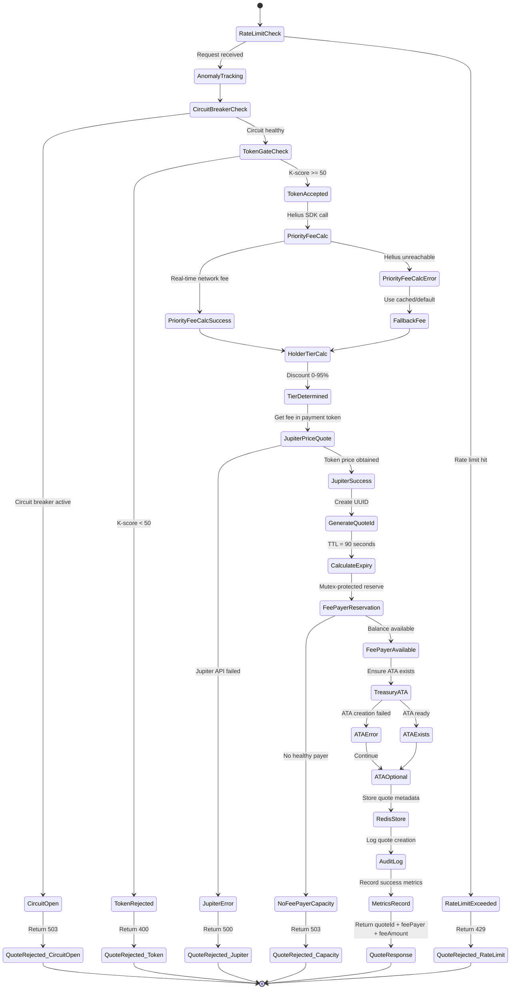
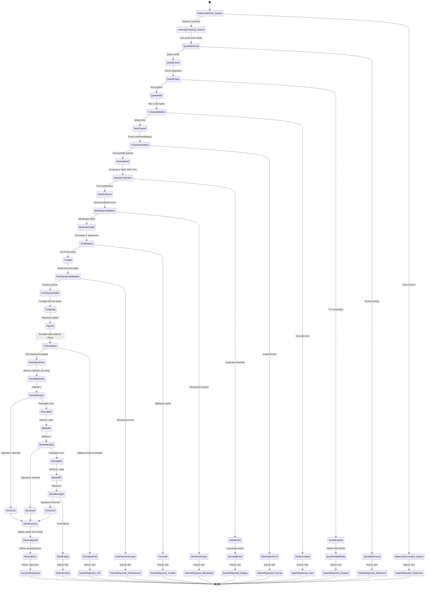
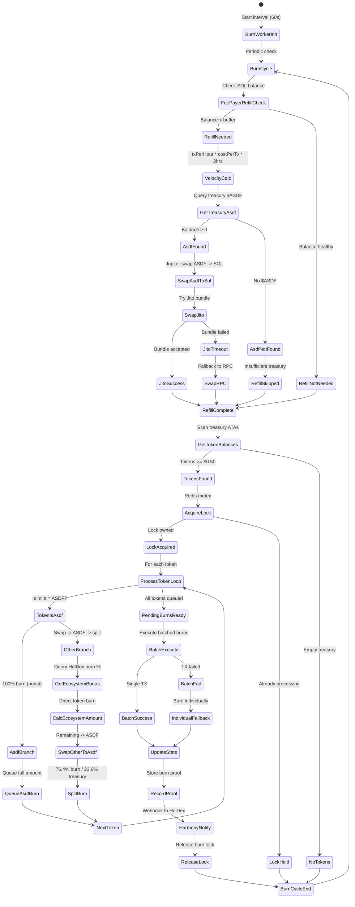

# GASdf State Machine Diagrams

> Generated 2026-01-10 - Maps all paths including error handling, retries, and external dependencies.

## 1. Quote Flow (Request → Quote ID)

### Key Dependencies
- **Redis**: Quote storage, rate limiting
- **Helius**: Priority fee calculation
- **Jupiter**: Token pricing
- **HolDex**: K-score verification

---

## 2. Submit Flow (Transaction → Broadcast)

### Security Checks
- **Replay Protection**: Atomic hash-based (SET NX in Redis)
- **CPI Protection**: Simulation with balance check (max 2.5M lamports)
- **Blockhash Validation**: Fresh validation via RPC

---

## 3. Burn Flow (Fee Collection → $ASDF Burn)

### Burn Model
| Payment Token | Flow |
|---------------|------|
| **$ASDF** | 100% burn (purist) |
| **Other** | Swap → $ASDF → 76.4% burn / 23.6% treasury |

### External Dependencies
- **Redis**: Distributed lock, velocity tracking
- **Jupiter**: Token swaps
- **Jito**: MEV-protected execution
- **HolDex**: Ecosystem burn bonus
