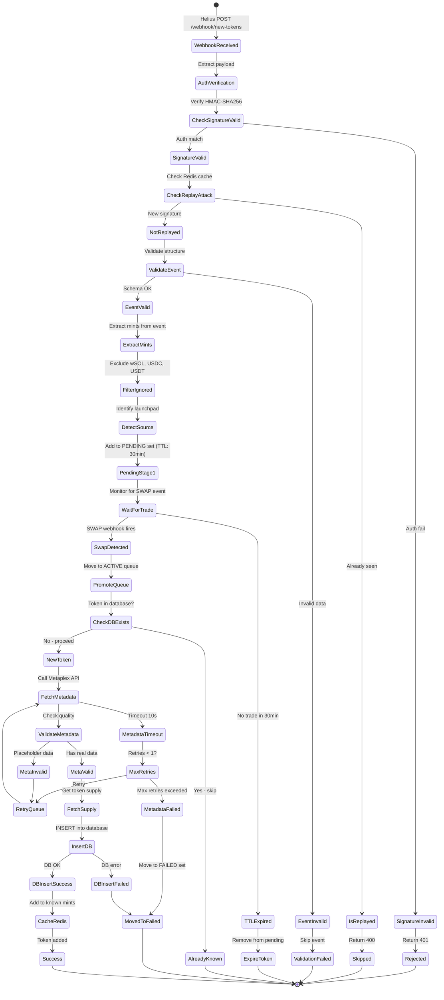

# HolDex State Machine Diagrams

> Generated 2026-01-10 - Maps all paths including retries, failures, and external dependencies.

## 1. Token Discovery Flow (Webhook → Queue → Storage)



### Token States
| State | TTL | Description |
|-------|-----|-------------|
| PENDING | 30 min | Awaiting first trade |
| PROMOTED | - | Trade detected, processing |
| ACTIVE | - | In database |
| FAILED | - | Max retries exceeded |

---

## 2. K-Score Calculation Flow (Signals → Scoring → Tiers)

```mermaid
stateDiagram-v2
    [*] --> FetchToken: K-Score updater cycle (5 min)

    FetchToken --> GetTokenData: Query database

    GetTokenData --> ValidateData: Check required fields

    ValidateData --> DataValid: All fields OK
    ValidateData --> DataInvalid: Missing critical

    DataInvalid --> SkipToken: Skip to next
    SkipToken --> [*]

    DataValid --> CheckCircuitBreaker: RPC circuit status?

    CheckCircuitBreaker --> CircuitOpen: Failures > 5
    CheckCircuitBreaker --> CircuitClosed: No issues

    CircuitOpen --> CircuitTest: Attempt recovery
    CircuitTest --> CircuitFails: Still failing
    CircuitFails --> [*]

    CircuitTest --> CircuitRecovered: Success
    CircuitRecovered --> CircuitClosed

    CircuitClosed --> FetchMarketData: Get price/liquidity

    FetchMarketData --> CheckCache: Price cached (2min)?

    CheckCache --> CacheHit: Use cache
    CheckCache --> CacheMiss: Fetch fresh

    CacheMiss --> CallPriceWorker: Get from PriceWorker

    CallPriceWorker --> PriceSuccess: Price OK
    CallPriceWorker --> PriceFail: API error

    PriceFail --> RecordFailure: Circuit breaker++
    RecordFailure --> [*]

    CacheHit --> MarketReady
    PriceSuccess --> MarketReady

    MarketReady --> FetchHolders: Query holder snapshots

    FetchHolders --> CalcDiamondHands: D = sqrt(C * R * F)

    CalcDiamondHands --> CalcOrganicGrowth: O = sqrt(H * T)

    CalcOrganicGrowth --> CalcLongevity: L = A * S

    CalcLongevity --> ComputeKScore: K = 100 * cbrt(D*O*L)

    ComputeKScore --> KScoreCalculated: K-Score OK
    ComputeKScore --> KScoreError: Math error

    KScoreError --> [*]

    KScoreCalculated --> DetermineTier: Map K to tier

    DetermineTier --> TierDiamond: K >= 75
    DetermineTier --> TierGold: 50-75
    DetermineTier --> TierSilver: 25-50
    DetermineTier --> TierBronze: 10-25
    DetermineTier --> TierUnranked: < 10

    TierDiamond --> SignData
    TierGold --> SignData
    TierSilver --> SignData
    TierBronze --> SignData
    TierUnranked --> SignData

    SignData --> SignIdentity: sig_identity
    SignIdentity --> SignSecurity: sig_security
    SignSecurity --> SignLP: sig_lp
    SignLP --> SignSupply: sig_supply
    SignSupply --> SignKScore: sig_kscore
    SignKScore --> SignMarket: sig_market
    SignMarket --> SignOrigin: sig_origin
    SignOrigin --> SignFull: sig_full
    SignFull --> ChaosNonce: chaos_nonce

    ChaosNonce --> UpdateDB: INSERT/UPDATE token

    UpdateDB --> DBUpdateSuccess: DB OK
    UpdateDB --> DBUpdateFailed: DB error

    DBUpdateFailed --> RecordFailure

    DBUpdateSuccess --> BroadcastUpdate: WebSocket broadcast

    BroadcastUpdate --> CompleteCycle: Cycle complete
    CompleteCycle --> [*]
```



### K-Score Formula
```
K = 100 * cbrt(D * O * L)

D = Diamond Hands = sqrt(C * R * F)
  C = Conviction (top 20% accumulator ratio)
  R = Acc/Ext ratio
  F = Activity freshness (1/e decay)

O = Organic Growth = sqrt(H * T)
  H = Holder count
  T = 1 - (top20/supply)

L = Longevity = A * S
  A = Age factor (asymptotes to 1)
  S = Survival factor
```

### Tier Thresholds
| Tier | K-Score | GASdf Multiplier |
|------|---------|------------------|
| Diamond | 90-100 | 1.0x |
| Platinum | 80-89 | 1.0x |
| Gold | 70-79 | 1.0x |
| Silver | 60-69 | 1.1x |
| Bronze | 50-59 | 1.2x |
| < Bronze | < 50 | **Rejected** |

---

## 3. Price Worker Flow (Fetching → Caching → Updates)

```mermaid
stateDiagram-v2
    [*] --> PriceUpdateCycle: Every 30 seconds

    PriceUpdateCycle --> GetAllTokens: Query tokens (limit 1000)

    GetAllTokens --> ClassifyByTier: Group by tier + staleness

    ClassifyByTier --> VerifiedTier: hasCommunityUpdate=TRUE
    ClassifyByTier --> Top100Tier: Top 100 volume
    ClassifyByTier --> ActiveTier: Volume > 1000
    ClassifyByTier --> DormantTier: Low volume

    VerifiedTier --> CheckRefreshTier: Age > 1 min?
    Top100Tier --> CheckRefreshTop100: Age > 1 min?
    ActiveTier --> CheckRefreshActive: Age > 5 min?
    DormantTier --> CheckRefreshDormant: Age > 30 min?

    CheckRefreshTier --> AddVerified: Yes - add to batch
    CheckRefreshTop100 --> AddTop100: Yes - add
    CheckRefreshActive --> AddActive: Yes (cap 100)
    CheckRefreshDormant --> AddDormant: Yes (cap 30)

    AddVerified --> BatchCreated
    AddTop100 --> BatchCreated
    AddActive --> BatchCreated
    AddDormant --> BatchCreated

    BatchCreated --> EmptyCheck: Any tokens?

    EmptyCheck --> BatchEmpty: No - skip
    BatchEmpty --> [*]

    EmptyCheck --> BatchReady: Yes - proceed

    BatchReady --> SplitBatches: Split into 100s

    SplitBatches --> CheckRaydium: Try Raydium (FREE)

    CheckRaydium --> RaydiumSuccess: Prices OK
    CheckRaydium --> RaydiumFail: Rate limit/timeout

    RaydiumFail --> MaxRaydiumRetry: 3 retries?

    MaxRaydiumRetry --> UseFallback: Yes - use Jupiter
    MaxRaydiumRetry --> RaydiumRetry: No - retry

    RaydiumRetry --> CheckRaydium

    RaydiumSuccess --> ValidatePrice

    UseFallback --> CheckJupiter: Try Jupiter (PAID)

    CheckJupiter --> JupiterSuccess: Prices OK
    CheckJupiter --> JupiterFail: Rate limit

    JupiterFail --> MaxJupiterRetry: 3 retries?

    MaxJupiterRetry --> NoPrice: Yes - no price
    MaxJupiterRetry --> JupiterRetry: No - retry

    JupiterRetry --> CheckJupiter

    JupiterSuccess --> ValidatePrice

    ValidatePrice --> PriceValid: Within bounds
    ValidatePrice --> PriceOutOfBounds: Outside bounds

    PriceOutOfBounds --> ClampPrice: Clamp to min/max

    PriceValid --> PriceReady
    ClampPrice --> PriceReady
    NoPrice --> PriceReady

    PriceReady --> FetchPoolInfo: Get liquidity from Raydium

    FetchPoolInfo --> PoolSuccess: Pool data OK
    FetchPoolInfo --> PoolTimeout: Timeout 10s

    PoolSuccess --> AllDataReady
    PoolTimeout --> AllDataReady

    AllDataReady --> BatchDBUpdate: Single unnest() UPDATE

    BatchDBUpdate --> DBUpdateSuccess: Batch OK
    BatchDBUpdate --> DBUpdateFailed: Batch failed

    DBUpdateFailed --> FallbackIndividual: Individual UPDATEs

    FallbackIndividual --> InvalidateSigMarket
    DBUpdateSuccess --> InvalidateSigMarket

    InvalidateSigMarket --> BroadcastPriceUpdate: WebSocket broadcast

    BroadcastPriceUpdate --> CycleComplete
    CycleComplete --> [*]
```



### Price Sources (Priority Order)
1. **Raydium Price API** - FREE, primary
2. **Jupiter Price API** - Paid fallback
3. **Pool Cache** - Stale fallback
4. **DB Cache** - Last resort

### Refresh Intervals by Tier
| Tier | Refresh Interval |
|------|------------------|
| Verified | 1 min |
| Top 100 | 1 min |
| Active | 5 min |
| Dormant | 30 min |
