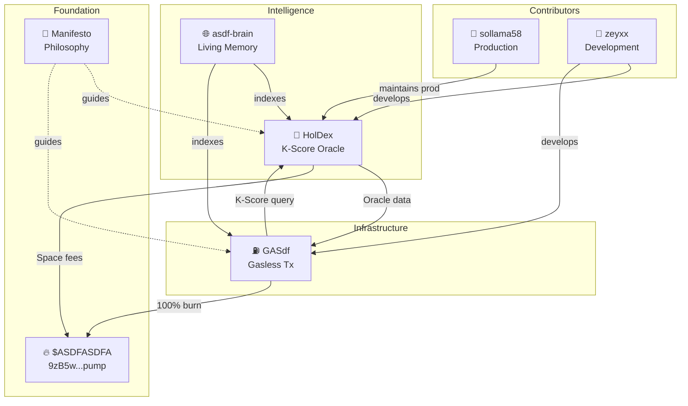

# $asdfasdfa Ecosystem - Verified Relations

> "Don't trust, verify" — All connections extracted from actual code

## Visual Map



## Verified Connections

### GASdf → HolDex
**Source:** `GASdf/src/services/holdex.js`

```
GASdf queries HolDex for:
├── K-Score (token health)
├── Token acceptance (K >= 50)
├── Metal rank (Diamond → Rust)
└── Credit rating (A1 → D)
```

### HolDex → GASdf
**Source:** `HolDex/src/routes/oracle.js`

```
HolDex provides to GASdf:
├── /oracle/acceptance - Token eligibility
├── /oracle/discount - K-Score based discounts
├── /oracle/fee - Exact fee calculation
└── Burn notification webhook
```

### Both → $ASDFASDFA
**Verified in:** `burn.js`, `space.js`

```
100% of fees burn $ASDFASDFA
├── GASdf: Every gasless transaction
├── HolDex Space: Community features
└── No extraction, ever
```

## φ Distribution

| Node | φ-weight | Layer |
|------|----------|-------|
| $ASDFASDFA | φ² (2.618) | Foundation |
| HolDex | φ (1.618) | Intelligence |
| GASdf | φ (1.618) | Infrastructure |
| asdf-brain | 1.0 | Meta |
| Manifesto | φ⁻¹ (0.618) | Philosophy |

## Key Invariants

1. **All fees burn** — No exceptions, no treasury skim
2. **K-Score >= 50** — Minimum for GASdf acceptance
3. **Bidirectional sync** — HolDex ↔ GASdf stay consistent
4. **Single source of truth** — HolDex for token data
